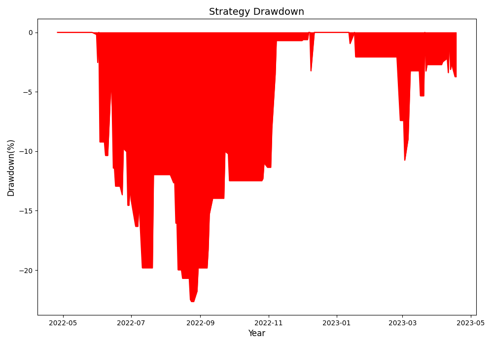

# Alogrithmic Trading Tool

A tool that will generate trading signals using technical momentum indicators for long-short and long-only trading strategies. 

Each individual file in this project can be run separately to generate the respective strategy/visualization

## Usage
Download project to local:
```bash
git clone https://github.com/kartikadimulam/Algorithmic-Trading-Tool.git
cd Algorithmic-Trading-Tool
```
To run a backtested trading strategy for AAPL that uses Stochastic Oscillators and RSI:

```bash
python3 AAPL_STOCHF_Backtest.py
```

You should see an output like this: 

```bash
Estimated slippage: 0.0022
Total Strategy Returns are 10.02%
Strategy CAGR is 1.95%
Sharpe ratio of this strategy is 0.49
Maximum drawdown of Long and Short strategy is -40.87%
Total Long Only Strategy Returns are 110.36%
Long Only Strategy CAGR is 16.27%
The Sharpe ratio of the long only strategy is 0.49
Maximum drawdown of Long Only Strategy is -30.46%
| Stats Name       |   Long and Short Strategy |   Long Only Strategy |
|------------------+---------------------------+----------------------|
| Strategy Returns |                 10.0167   |            110.359   |
| Sharpe           |                  0.487167 |              1.26235 |
| CAGR             |                  1.95421  |             16.2721  |
| Maximum Drawdown |                -40.8694   |            -30.4631  |

```


To create a candlestick model for TSLA stock:

```bash
python3 TSLA_Candlestick.py
```

This should generate a candlestick model looking like this:


To run a trend-based trading strategy for TSLA stock that uses EMA, Stochastic Oscillators, and Parabolic SAR:

```bash
python3 TBASED_TSLA.py
```

You should see an output like this:

```bash
Maximum drawdown of the strategy equals -22.64%
Sharpe Ratio: 0.94
```



To visualize a Relative Strength Index trading strategy and its trading signals for NVDA:

```bash
python3 RSI_NVDA.py
```
It should produce an output like this:


To run a volume reversal trading strategy for AAPL stock data:

```bash
python3 VReversal_AAPl.py
```

You should see a returns output like this:


To run a trading strategy that uses Bollinger Bands to generate trading signals for MSFT:

```bash
python3 BBANDS_MSFT.py
```

You should see a visual output specifying # of trades:


